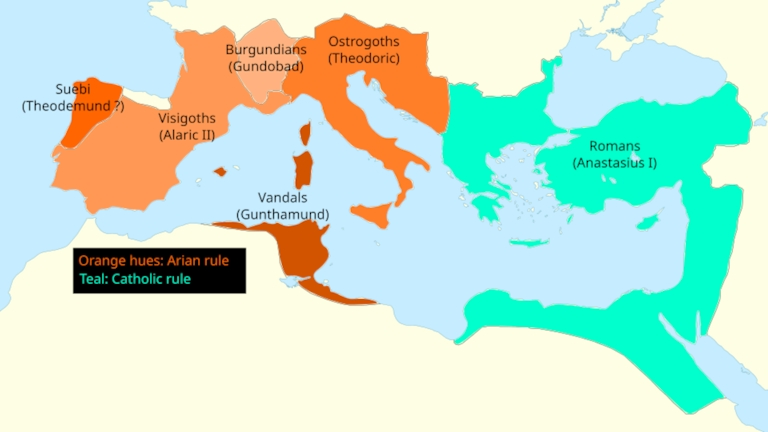

# 395 (Dark Ages)

The period following the collapse of the Western Roman Empire is often shrouded in mystery and debate. Commonly known as the "Dark Ages," this era saw the fragmentation of a once-mighty empire into a mosaic of Germanic kingdoms. As these new powers rose and fell, they also navigated a complex religious landscape, eventually leading to the decline of Arianism and the consolidation of Nicene Christianity.

## The Imperial Split

In 395 CE, the [Roman Empire split into two separate states](https://study.com/academy/lesson/the-division-of-rome-into-eastern-and-western-empires.html). This occurred after the death of the Roman emperor Theodosius I. His two sons, Honorius and Arcadius, succeeded him. Honorius ruled the Western Roman Empire. Arcadius governed the Eastern Roman Empire.

Some view this fragmentation as a fulfilment of the [prophecy](https://prophecies.ofgod.info) in Daniel 2, which describes a kingdom that becomes divided.

## Western Rome's Fall

In 476 CE, [the Western Roman Empire fell](https://en.wikipedia.org/wiki/Deposition_of_Romulus_Augustus) to Odovacar, the Germanic king. This event traditionally marks [the end of the Western Roman Empire](https://dlab.epfl.ch/wikispeedia/wpcd/wp/r/Romulus_Augustus.htm).

Odovacar sent the western imperial regalia, including the crown and scepter, to Constantinople. This capital served the rival Eastern Roman Empire, also known as the Byzantine Empire. The gesture acknowledged the supremacy of the Eastern Emperor.

Following this fall, the western territories fragmented into various Germanic kingdoms. These successor states included the Ostrogothic Kingdom in Italy and the Visigothic Kingdom in Spain.

## Decline of Arianism

As the Western Roman Empire disintegrated, several Germanic tribes that had adopted [Arianism](337-arianism.md) established their own kingdoms. Arianism was a theological doctrine that challenged the divinity of Christ as defined by the [Nicene Creed](325-nicaea-creed.md). Over time, these Arian nations were either militarily defeated or voluntarily converted to Nicene orthodoxy.

In 507, the [Visigoths](https://en.wikipedia.org/wiki/Visigoths) were defeated by the Franks under Clovis I at the Battle of Vouillé.

In 534, the [Vandals](https://en.wikipedia.org/wiki/Vandals), an Arian Germanic tribe, were militarily defeated by the Byzantine Empire during the Vandalic War. Their remnants were dispersed, and they ceased to function as a cohesive Arian nation.

In 553, the [Ostrogoths](https://en.wikipedia.org/wiki/Ostrogoths) were defeated by the Byzantine Empire.

In 653, the [Lombards](https://en.wikipedia.org/wiki/Lombards) adopted Nicene orthodoxy under King Aripert I.

While no Arian nations survived as distinct political entities, [Arianism persisted among certain Germanic groups](https://en.wikipedia.org/wiki/Arianism).

## Comparison of belief systems

The transition from Arianism to Nicene orthodoxy was a significant theological shift. These two systems held different views on [the nature of Jesus](https://son.ofgod.info/nature).

The decline and eventual disappearance of Arian nations had a profound effect on the development of Christianity. With the fall of these kingdoms, the [Nicene Creed](325-nicaea-creed.md) and the doctrine of the [Trinity](https://son.ofgod.info/trinity) became the dominant and virtually unchallenged standards of faith in Western Europe. The separate church hierarchies that had served Arian elites were abolished, leading to a more unified religious landscape under the authority of the [Catholic Church](https://en.wikipedia.org/wiki/Catholic_Church).

During this era, the collapse of Roman imperial authority in the West allowed the [Papacy](https://en.wikipedia.org/wiki/History_of_the_papacy) to gain significant spiritual and temporal influence. The Church became the primary unifying institution across a fragmented continent. Simultaneously, [monasticism](https://en.wikipedia.org/wiki/Christian_monasticism) flourished, with monasteries serving as vital centers for the preservation of classical knowledge and the spread of the faith through [missionary activity](https://en.wikipedia.org/wiki/Christianization). These developments laid the foundation for the religious and political structures of the High Middle Ages.

Critics might argue that these conversions were purely [political rather than spiritual](380-state-religion.md). However, the adoption of Nicene orthodoxy provided a unifying religious framework for the emerging European nations. It helped bridge the gap between the Germanic rulers and the majority Roman population.

## Conclusion

The early Middle Ages saw the Roman Empire transition from a unified power to a collection of fragmented kingdoms. The [split of the
empire](#the-imperial-split) and the [subsequent fall of the west](#western-romes-fall) paved the way for new political entities. The
eventual [decline or conversion of Arian kingdoms](#decline-of-arianism) further consolidated the religious and political map of the era.
